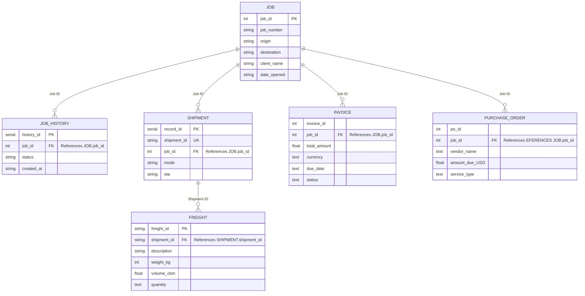

# Description
This Flask API will service the PostgreSQL freightjobs database (see diagram in "Flask API Architecture" below). It provices a service to developers by graniting them database table "CRUD" actions to CREATE, READ, UPDATE, and DELETE the Job, Job History, Shipment, Freight, Invoice, and Purchase Order tables located within the database and runs as a funcamental part of the CDC pipeline (see diagram below)

```mermaid
%%{init: {'theme': 'dark', 'themeVariables': { 'mainBkg': '#000000', 'lineColor': '#ffffff' }}}%%
flowchart LR
    subgraph Infrastructure_Layer [Terraform Managed Infrastructure]
        direction TB
        
        subgraph App_Tier [Application Tier]
            A[Python Job Simulator] -- "Write Stream" --> B
            F[Flask Server] -- "CRUD Actions" --> B
        end

        subgraph Database_Tier [Storage & Capture]
            B[(PostgreSQL)] -- "WAL" --> C
            C{Debezium CDC}
        end

        subgraph Streaming_Tier [Data Processing & Delivery]
            C -- "Events" --> D[Materialize]
            D -- "Publish" --> E([Redpanda Topic])
        end
    end

    %% Styling for Dark Mode Contrast
    style Infrastructure_Layer fill:#1a1a1a,stroke:#555,color:#fff, font-size:13px
    style App_Tier fill:#222,stroke:#444
    style Database_Tier fill:#222,stroke:#444
    style Streaming_Tier fill:#222,stroke:#444
    
    style B fill:#336791,stroke:#fff,color:#fff
    style E fill:#e94d35,stroke:#fff,color:#fff
    style C fill:#ff9900,stroke:#000,color:#000
    style D fill:#00d2ff,stroke:#000,color:#000

```



# Flask API Architecture

The following diagram represents the database table structure and relationships.



# Getting Started and Installation 
It is recommended to run this API as part of the complete CDC pipline described in the above diagram, but it can also be run loacally if prefered.

Terraform:
  To run the Flask API within the complete CDC pipline with terraform, run the 'make up' command from the top level directory where the Makefile is located. This comand will run the terraform apply -auto-approve command and use the main.tf file to build all needed pipline docker containers, including theis Flask API.  

Locally:
  The following steps describe how to properly install and configure an environment for running the webserver locally.  

## Requirements
The following tools and packages, not extensive, are being used can be seen in [requirements.txt] 

* Python 3: https://www.python.org/
  * Server code is written in python

* Flask: https://flask.palletsprojects.com/en/stable/
  * Microframework used for web-application development

* Flask-SQLAlchemy: https://flask-sqlalchemy.palletsprojects.com/en/stable/
  * Object Relational-Mapping (ORM) style interface between flask application and the relational database
  
* Flask-WTF: https://flask-wtf.readthedocs.io/en/stable/
    * Object-Oriented form creation for flask


### Environment Setup  
It is recommended that a python virtual environment is configured and used to deploy the webserver. 
This ensure that only dependencies needed for this application are installed. 

1. Setup a virtual environment
    - Run this command from within [flask_api] folder: 
    
    `python3 -m venv .env`. 

2. Activate the virtual environment run the commands:  

    `source env/bin/activate`. 

    - You should see `(env)` precede your username. To leave the virtual environment enter the command: `deactivate`

3. Use the [requirements.txt] to install the required packages and dependencies. 
    - This can be done using the command: 
    
    `pip3 install -r requirements.txt`

4. If running locally, environment variables need to be set prior to running the webserver. These can be set by setting the variables from within the [set_flask_variables.sh] and running the script with the command:

    `source ./set_flask_variables.sh`

### Environment Setup Notes
There could be issues installing psycopg2, these are typically related to having the 
postgres database properly installed.  See the database setup section for more details.
There could be issues installing packages due to the requirements specifying a version 
of a package this isn't accessible via pip3.  Lower the version number to one that is accessible 
and check to see if there are any errors after completing the setup.

# Database Setup  
This webserver connects to a postgres database to store freight shipping information. The database can be run locally or in Terraform. See top level README.md for loacl and make run setups.  

# Running the webserver

## Debug #
After creating the environment, entering the environment, installing the requirements, 
and setting the flask variables; the server can be started using the following command within the flask_api directory:

Debug:
```bash
`python3 wsgi.py`  
```

Gunicorn with Logging:

```bash
  gunicorn -w 1 --timeout=300 --bind 0.0.0.0:5000 \
		--log-level=error \
		--access-logfile=./logs/API_access.log \
		--error-logfile=./logs/API_error.log \
		wsgi:app  \
		*>> ./logs/flask_error.log
```

A log file with access and Flask erors can be found in the ./flask_api/logs directory.

## CRUD Routes #

An example test python script, "Flask_Route_Testing.py", can be found in the /flask_api/testing/ directory. It should be modified to fit the testers needs.

The following table contains the API CRUD routes with brief description.


| Host | Port |
| :------ | :------ |
| http://127.0.0.1: | 5000 |

| Method | Table | Endpoint | Description |
| :--- | :--- | :--- | :--- |
| POST | JOB | /job/create | Creates a new Job |
| GET | JOB | /jobs | Reads all current Jobs |
| GET | JOB | /job/<job_id> | Reads one Job |
| PUT | JOB | /job/update/<job_id> | Updates one Job |
| DELETE | JOB | /job/delete/<job_id> | Deletes one Job |
| POST | JOB HISTORY | /job_history/create | Creates a new Job History |
| GET | JOB HISTORY | /jobs_history | Reads all current Job Histories |
| GET | JOB HISTORY | /job_history/<job_id> | Reads one Job  History |
| PUT | JOB HISTORY | /job_history/update/<job_id> | Updates one Job History  |
| DELETE | JOB HISTORY | /job_history/delete/<job_id> | Deletes one Job History |
| POST | SHIPMENT | /shipment/create | Creates a new Shipment |
| GET | SHIPMENT | /shipments | Reads all current Shipments|
| GET | SHIPMENT | /shipment/<shipment_id> | Reads one Shipment |
| PUT | SHIPMENT| /shipment/update/<job_id> | Updates one Shipment  |
| DELETE | SHIPMENT | /shipment/delete/<job_id> | Deletes one Shipment |
| POST | FREIGHT | /freight/create | Creates a new Freight |
| GET | FREIGHT | /freights | Reads all current Freights|
| GET | FREIGHT | /freight/<freight_id> | Reads one Freight |
| PUT | FREIGHT| /freight/update/<freight_id> | Updates one Freight  |
| DELETE | FREIGHT | /freight/delete/<freight_id> | Deletes one Freight |
| POST | INVOICE | /invoice/create | Creates a new Invoice |
| GET | INVOICE | /invoices | Reads all current Invoices|
| GET | INVOICE | /invoice/<invoice_id> | Reads one Invoice |
| PUT | INVOICE| /invoice/update/<job_id> | Updates one Invoice  |
| DELETE | INVOICE | /invoice/delete/<invoice_id> | Deletes one Invoice |
| POST | PURCHASE ORDER | /purchaseorder/create | Creates a new Purchase Order |
| GET | PURCHASE ORDER | /purchaseorders | Reads all current Purchase Order|
| GET | PURCHASE ORDER | /purchaseorder/<job_id>| Reads one Purchase Order |
| PUT | PURCHASE ORDER| /purchaseorder/update/<job_id> | Updates one Purchase Order  |
| DELETE | PURCHASE ORDER | /purchaseorder/delete/<job_id> | Deletes one Purchase Order |